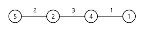

## 문제

---

### 1. "잃어버린 괄호"
- 색인 : [1541](https://www.acmicpc.net/problem/1541)
- 문제 :
  - 세준이는 양수와 +, -, 그리고 괄호를 가지고 식을 만들었다. 그리고 나서 세준이는 괄호를 모두 지웠다.
  - 그리고 나서 세준이는 괄호를 적절히 쳐서 이 식의 값을 최소로 만들려고 한다.
  - 괄호를 적절히 쳐서 이 식의 값을 최소로 만드는 프로그램을 작성하시오.

- 입력 조건 : 
  - 첫째 줄에 식이 주어진다. 식은 ‘0’~‘9’, ‘+’, 그리고 ‘-’만으로 이루어져 있고, 가장 처음과 마지막 문자는 숫자이다. 
  - 그리고 연속해서 두 개 이상의 연산자가 나타나지 않고, 5자리보다 많이 연속되는 숫자는 없다. 수는 0으로 시작할 수 있다. 입력으로 주어지는 식의 길이는 50보다 작거나 같다.

- 출력 조건 : 
  - 첫째 줄에 정답을 출력한다.

- 입력 예시 :
  ```
  55-50+40
  ```  

- 출력 예시 :
  ```
  -35
  ```
---

### 2. "회의실 배정"
- 색인 : [1931](https://www.acmicpc.net/problem/1931)
- 문제 :
  - 한 개의 회의실이 있는데 이를 사용하고자 하는 N개의 회의에 대하여 회의실 사용표를 만들려고 한다. 
  - 각 회의 I에 대해 시작시간과 끝나는 시간이 주어져 있고, 각 회의가 겹치지 않게 하면서 회의실을 사용할 수 있는 회의의 최대 개수를 찾아보자. 
  - 단, 회의는 한번 시작하면 중간에 중단될 수 없으며 한 회의가 끝나는 것과 동시에 다음 회의가 시작될 수 있다. 
  - 회의의 시작시간과 끝나는 시간이 같을 수도 있다. 
  - 이 경우에는 시작하자마자 끝나는 것으로 생각하면 된다.

- 입력 조건 : 
  - 첫째 줄에 회의의 수 N(1 ≤ N ≤ 100,000)이 주어진다.
  - 둘째 줄부터 N+1 줄까지 각 회의의 정보가 주어지는데 이것은 공백을 사이에 두고 회의의 시작시간과 끝나는 시간이 주어진다.
  - 시작 시간과 끝나는 시간은 2^31-1보다 작거나 같은 자연수 또는 0이다.

- 출력 조건 : 
  - 첫째 줄에 최대 사용할 수 있는 회의의 최대 개수를 출력한다.

- 입력 예시 :
  ```
  11
  1 4
  3 5
  0 6
  5 7
  3 8
  5 9
  6 10
  8 11
  8 12
  2 13
  12 14
  ```  

- 출력 예시 :
  ```
  4
  ```

---
### 3. "동전 0"
- 색인 : [11047](https://www.acmicpc.net/problem/11047)
- 문제 :
  - 준규가 가지고 있는 동전은 총 N종류이고, 각각의 동전을 매우 많이 가지고 있다.
  - 동전을 적절히 사용해서 그 가치의 합을 K로 만들려고 한다. 
  - 이때 필요한 동전 개수의 최솟값을 구하는 프로그램을 작성하시오.

- 입력 조건 : 
  - 첫째 줄에 N과 K가 주어진다. (1 ≤ N ≤ 10, 1 ≤ K ≤ 100,000,000)
  - 둘째 줄부터 N개의 줄에 동전의 가치 Ai가 오름차순으로 주어진다.(1 ≤ Ai ≤ 1,000,000, A1 = 1, i ≥ 2인 경우에 Ai는 Ai-1의 배수)

- 출력 조건 : 
  - 첫째 줄에 K원을 만드는데 필요한 동전 개수의 최솟값을 출력한다

- 입력 예시 :
  ```
  10 4200
  1
  5
  10
  50
  100
  500
  1000
  5000
  10000
  50000
  ```  

- 출력 예시 :
  ```
  6
  ```

---
### 4. "ATM"
- 색인 : [11399](https://www.acmicpc.net/problem/11399)
- 문제 :
  - 인하은행에는 ATM이 1대밖에 없다. 지금 이 ATM앞에 N명의 사람들이 줄을 서있다.
  - 사람은 1번부터 N번까지 번호가 매겨져 있으며, i번 사람이 돈을 인출하는데 걸리는 시간은 Pi분이다.
  - 사람들이 줄을 서는 순서에 따라서, 돈을 인출하는데 필요한 시간의 합이 달라지게 된다.
  - 예를 들어, 총 5명이 있고, P1 = 3, P2 = 1, P3 = 4, P4 = 3, P5 = 2 인 경우를 생각해보자. 
  - [1, 2, 3, 4, 5] 순서로 줄을 선다면, 1번 사람은 3분만에 돈을 뽑을 수 있다.
  - 2번 사람은 1번 사람이 돈을 뽑을 때 까지 기다려야 하기 때문에, 3+1 = 4분이 걸리게 된다.
  - 3번 사람은 1번, 2번 사람이 돈을 뽑을 때까지 기다려야 하기 때문에, 총 3+1+4 = 8분이 필요하게 된다.
  - 4번 사람은 3+1+4+3 = 11분, 5번 사람은 3+1+4+3+2 = 13분이 걸리게 된다.
  - 이 경우에 각 사람이 돈을 인출하는데 필요한 시간의 합은 3+4+8+11+13 = 39분이 된다.
  - 줄을 [2, 5, 1, 4, 3] 순서로 줄을 서면, 2번 사람은 1분만에, 5번 사람은 1+2 = 3분, 1번 사람은 1+2+3 = 6분, 4번 사람은 1+2+3+3 = 9분, 3번 사람은 1+2+3+3+4 = 13분이 걸리게 된다.
  - 각 사람이 돈을 인출하는데 필요한 시간의 합은 1+3+6+9+13 = 32분이다. 이 방법보다 더 필요한 시간의 합을 최소로 만들 수는 없다.
  - 줄을 서 있는 사람의 수 N과 각 사람이 돈을 인출하는데 걸리는 시간 Pi가 주어졌을 때, 각 사람이 돈을 인출하는데 필요한 시간의 합의 최솟값을 구하는 프로그램을 작성하시오.

- 입력 조건 : 
  - 첫째 줄에 사람의 수 N(1 ≤ N ≤ 1,000)이 주어진다. 둘째 줄에는 각 사람이 돈을 인출하는데 걸리는 시간 Pi가 주어진다. (1 ≤ Pi ≤ 1,000)

- 출력 조건 : 
  - 첫째 줄에 각 사람이 돈을 인출하는데 필요한 시간의 합의 최솟값을 출력한다.

- 입력 예시 :
  ```
  5
  3 1 4 3 2
  ```  

- 출력 예시 :
  ```
  32
  ```

---
### 5. "주유소"
- 색인 : [13305](https://www.acmicpc.net/problem/13305)
- 문제 :
  - 어떤 나라에 N개의 도시가 있다. 이 도시들은 일직선 도로 위에 있다.
  - 편의상 일직선을 수평 방향으로 두자.
  - 제일 왼쪽의 도시에서 제일 오른쪽의 도시로 자동차를 이용하여 이동하려고 한다.
  - 인접한 두 도시 사이의 도로들은 서로 길이가 다를 수 있다.
  - 도로 길이의 단위는 km를 사용한다.
  - 처음 출발할 때 자동차에는 기름이 없어서 주유소에서 기름을 넣고 출발하여야 한다.
  - 기름통의 크기는 무제한이어서 얼마든지 많은 기름을 넣을 수 있다.
  - 도로를 이용하여 이동할 때 1km마다 1리터의 기름을 사용한다.
  - 각 도시에는 단 하나의 주유소가 있으며, 도시 마다 주유소의 리터당 가격은 다를 수 있다.
  - 가격의 단위는 원을 사용한다.
  - 예를 들어, 이 나라에 다음 그림처럼 4개의 도시가 있다고 하자.  

    

  - 원 안에 있는 숫자는 그 도시에 있는 주유소의 리터당 가격이다.
  - 도로 위에 있는 숫자는 도로의 길이를 표시한 것이다. 
  - 제일 왼쪽 도시에서 6리터의 기름을 넣고, 더 이상의 주유 없이 제일 오른쪽 도시까지 이동하면 총 비용은 30원이다.
  - 만약 제일 왼쪽 도시에서 2리터의 기름을 넣고(2×5 = 10원) 다음 번 도시까지 이동한 후 3리터의 기름을 넣고(3×2 = 6원) 다음 도시에서 1리터의 기름을 넣어(1×4 = 4원) 제일 오른쪽 도시로 이동하면, 총 비용은 20원이다.
  - 또 다른 방법으로 제일 왼쪽 도시에서 2리터의 기름을 넣고(2×5 = 10원) 다음 번 도시까지 이동한 후 4리터의 기름을 넣고(4×2 = 8원) 제일 오른쪽 도시까지 이동하면, 총 비용은 18원이다.
  - 각 도시에 있는 주유소의 기름 가격과, 각 도시를 연결하는 도로의 길이를 입력으로 받아 제일 왼쪽 도시에서 제일 오른쪽 도시로 이동하는 최소의 비용을 계산하는 프로그램을 작성하시오.

- 입력 조건 : 
  - 표준 입력으로 다음 정보가 주어진다.
  - 첫 번째 줄에는 도시의 개수를 나타내는 정수 N(2 ≤ N ≤ 100,000)이 주어진다.
  - 다음 줄에는 인접한 두 도시를 연결하는 도로의 길이가 제일 왼쪽 도로부터 N-1개의 자연수로 주어진다.
  - 다음 줄에는 주유소의 리터당 가격이 제일 왼쪽 도시부터 순서대로 N개의 자연수로 주어진다.
  - 제일 왼쪽 도시부터 제일 오른쪽 도시까지의 거리는 1이상 1,000,000,000 이하의 자연수이다.
  - 리터당 가격은 1 이상 1,000,000,000 이하의 자연수이다. 

- 출력 조건 : 
  - 표준 출력으로 제일 왼쪽 도시에서 제일 오른쪽 도시로 가는 최소 비용을 출력한다. 

- 입력 예시 :
  ```
  4
  2 3 1
  5 2 4 1
  ```  

- 출력 예시 :
  ```
  18
  ```

